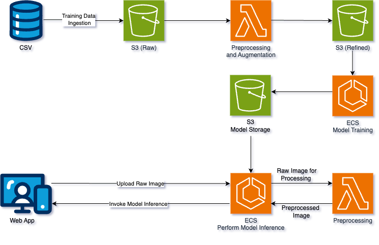

# How are you feeling?
#### Cloud Engineering Final Project

Contributors: Gabriel Zhang, Kate Yee, Xenia Vrettakou & Zoe Li

## Purpose
Addressing mental health concerns has become increasingly important in the persisting isolation of the post-pandemic period. Our goal for this project was to create a cloud based web app to enable early detection of emotional distress to proactively provide students with counselling services.


## Architecture


Our architecture can be easily split into three processes:

**1. Training Data Augmentation** - When an image training data set is uploaded to the S3 Raw bucket, a lambda function is triggered to ingest that dataset, create an augmented image dataset, and upload the resulting augmented dataset to the S3 Refined bucket.

**2. Model Training** - The model training pipeline is containerized in ECR and can be deployed as an ECS task to ingest an augmented dataset from the S3 Refined bucket, train, evaluate, and score a model, and uploaded a pickled model and related artifacts to the S3 Model Storage bucket.

**3. Inference Web Application** - The web application is deployed as a streamlit app containerized in an ECS service. A user can upload a raw image to the web app that the service will send to a lambda function for preprocessing. The preprocessed image is then returned to the ECS service, which pulls a model from the S3 Model Storage bucket, predicts an emotion from the given image, and returns the inferred emotion to be displayed on the web app to the user.

Here is a link to our cost estimation for this architecture: ***link***

## Repository Overview
This repository contains all the code necessary to deploy on AWS the architecture previously described. The contents of the repository are detailed below:

- `app/`: The directory containing the script and resources for running the streamlit web application.
- `config/`: Do we need to delete this one?
- `dockerfiles/`: The directory containg dockerfiles for building the web app.
- `images/`: The directory containg images referenced in this README.
- `pipeline/`: The directory containing the model training pipeline scripts and associated resources including specifc configuration files, logs, unit tests, modules, requirements, and Dockerfile.
- `preprocessing_lambda/`: The directory containing the script used to augment training data.
- `src/`: I think we need to delete this
- `tests/`: I think we need to delete this
- `.gitignore`: The file detailing untracked files Git should ignore.
- `.pylintrc`: The file containing the lintr standard configurations for this repository.
- `README.md`: The README you're reading right now.
- `pipeline_model.py`: I think we need to delete this.
- `requirements.txt`: I think we need to delete this.

## Deployment Overview

### Preprocessing Lambda

### Model Training

### Web Application

#### Run Dockerfile for web app 
```
docker build -t fer-app -f dockerfiles/Dockerfile-app .
docker run -p 80:80 fer-app
```
